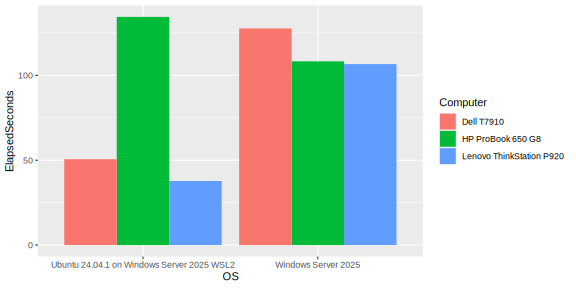
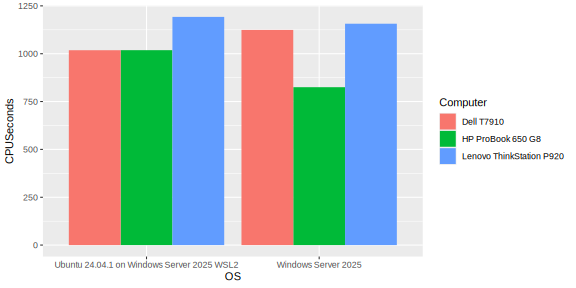
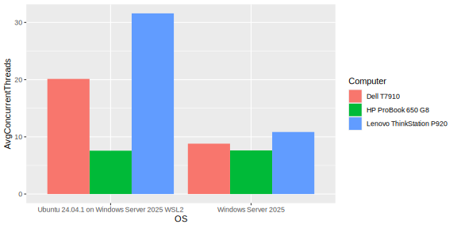

# DuckDB Performance Testing

I decided to compare DuckDB performance between Windows and Linux running in WSL2.

I have 3 computers that I used for testing, each have Windows Server 2025 installed, with WSL2 and Ubuntu 24.04.1 enabled. All OS patches are applied as of 1/24/2025.

On both Windows and Linux, I generated my own TPC-H SF100 file inside a local directory (on C: for Windows, and on the /home partition for Linux) using this command:

    CALL dbgen(sf = 100);

Each test was run twice and the second run is reported here.

The test was conducted by a Python script running each TPC-H script in order, and measuring the total CPU time and Elapsed time for all scripts.

## Results

See [res.csv](res.csv) for the detailed results including computer specs.

### Elapsed Time

## CPU Time

## Average Concurrent Threads

## Interesting Points

On the server/workstations with dual CPUs with many cores, it scaled to more threads under Linux and finished faster than running natively in Windows.

On the laptop with much fewer cores, it ran slightly faster overall in the native Windows version.

Under Windows, the laptop with 4 cores and 8 threads kept pace with the dual Xeons on the two workstations, while under Linux the laptop fell behind.

On the laptop, with 4 cores and 8 threads (HT on), on average 7.6 were active under both Windows and Linux.

On the Dell T7910 with 28 cores and 28 threads (HT off), on average 8.8 were active on Windows and 20.1 on Linux.

On The Lenovo P920 with 48 cores and 48 threads (HT off), on average 10.8 were active on Windows and 31.6 were active on Linux.

**I'm not sure why this happens.**
